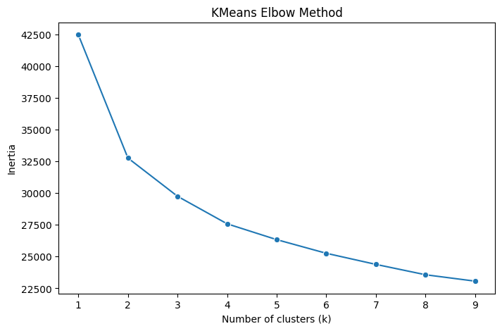
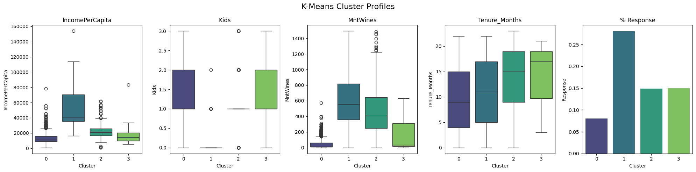
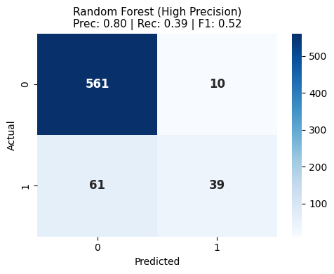
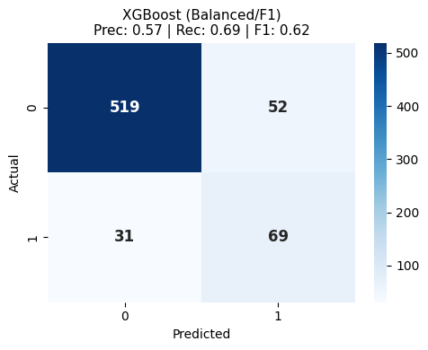
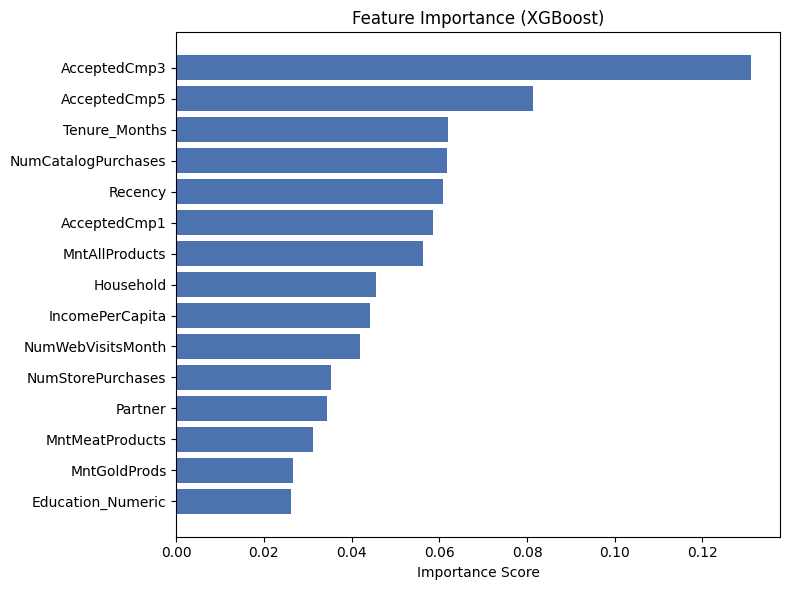

# Customer Segmentation & Propensity Modeling

**Optimize marketing ROI by replacing mass targeting with data-driven segmentation and conversion prediction models.**

## 📌 Project Objective
Modern e-commerce faces rising customer acquisition costs. The traditional approach of sending the same offer to the entire customer base leads to a burned marketing budget and customer irritation. 

The main goal of this project is to develop an analytical model to support marketing decisions. This is achieved through two main tasks:
1. **Behavioral Segmentation (Clustering):** Identifying natural customer groups to tailor specific communication.
2. **Conversion Prediction (Classification):** Predicting the probability of a positive customer response to a new campaign.

**Hypothesis:** Transaction history and behavioral data are significantly better predictors of campaign success than static demographic data.

## 📊 Dataset & Feature Engineering
The analysis is based on the "Customer Personality Analysis" dataset from Kaggle (approx. 2240 rows). 
*Kaggle link: https://www.kaggle.com/datasets/imakash3011/customer-personality-analysis/data*
To improve model precision, raw variables were transformed into robust business features:
* `IncomePerCapita`: Household income divided by household size to reflect true purchasing power.
* `Tenure_Months`: Customer lifespan in months.
* `Kids` & `Partner`: Consolidated demographic indicators.
* `AcceptedCmp`: Sum of previously accepted promotional offers.

## 🧩 Part 1: Customer Segmentation
Tested algorithms: *K-Means, Agglomerative Clustering, Gaussian Mixture Model (GMM)*.
Based on Silhouette Score and the Elbow Method, **K-Means (k=4)** was selected as the optimal model, maximizing the conversion rate variance between clusters (up to 20 percentage points difference).

*Inertia curve suggesting optimal k=3 or k=4*

Identified Personas:
1. **"Thrifty Parents" (Mass Segment):** Largest group, lower income, with kids. Lowest conversion rate (<10%). *Recommendation: Exclude from expensive marketing campaigns.*
2. **"VIP":** Highest income and spend, mostly no kids. Highest conversion rate (~30%). *Recommendation: Prime target for premium offers.*
3. **"Wealthy Families":** High income and high spend, with kids. Average conversion (15%). *Recommendation: Maintain loyalty.*
4. **"Veterans":** Average income/spend, but very long tenure. Average conversion (15%).

*Variable distributions across customer segments*

## 🎯 Part 2: Conversion Prediction
The dataset was highly imbalanced (~15% positive responses). To predict campaign response, classification models (Logistic Regression, Random Forest, XGBoost) were built and tuned. 

Strategic optimization and the choice of the final model depend on the company's business strategy:
* 🛡️ **Cost-Saving Strategy (Random Forest tuned for High Precision):** Maximizes precision (80%) and minimizes false positives (only 10 errors). Perfect if the marketing budget is strictly limited, though it reaches fewer interested customers (Recall: 39%).

*Random Forest Confusion Matrix*

* 🚀 **Growth Strategy (XGBoost tuned for F1-Score / High Recall):** The recommended model. It captures nearly 70% of all genuinely interested customers with an acceptable precision of 57%, ultimately maximizing the overall revenue potential.

*XGBoost Confusion Matrix*

## 🔍 Feature Importance — Confirming the Hypothesis
Analysis of feature importance across both models provided strong evidence for the research hypothesis:

* Behavioral data dominates: The top predictors in XGBoost were prior campaign responses (AcceptedCmp3, AcceptedCmp5) and customer tenure (Tenure_Months). In Random Forest (precision-focused), Recency ranked highest — identifying customers active right now.
* Economic factors matter: IncomePerCapita and MntAllProducts ranked highly in both models, reinforcing the segmentation findings.
* Demographics are marginal: Age and Education_Numerical ranked at the bottom of both importance lists.
This confirms that behavioral profiling significantly outperforms traditional demographic targeting.

*Feature Importance*

## ⚠️ Limitations
* The dataset (~2,200 records) is sufficient for prototyping (Proof of Concept) but may be too small to capture rare behavioral patterns or purchase seasonality in production.
* Gender data was unavailable — a potentially significant differentiator for luxury or cosmetic product categories.
* Spending data was aggregated over 2 years with no timestamps, preventing time-series analysis of purchase frequency or churn detection.

## 📁 Project structure
├── images/                                       # Generated plots and confusion matrices
├── notebooks/ 
│   ├── 01_exploration_and_experiments.ipynb      # Raw EDA and model testing
│   └── 02_final_analysis_and_business_insights.ipynb  # Final, streamlined project code
├── .gitignore
├── README.md                                     # Project overview
└── requirements.txt                              # Dependencies

## 🚀 How to Run
1. Clone the repository: git clone [Your-GitHub-Link]
2. Create virtual environment: python -m venv venv and activate it.
3. Install dependencies: pip install -r requirements.txt
4. Download the dataset from Kaggle and place it in the data/ folder.
5. Run the Jupyter Notebooks in notebooks/ to see the full analysis.
